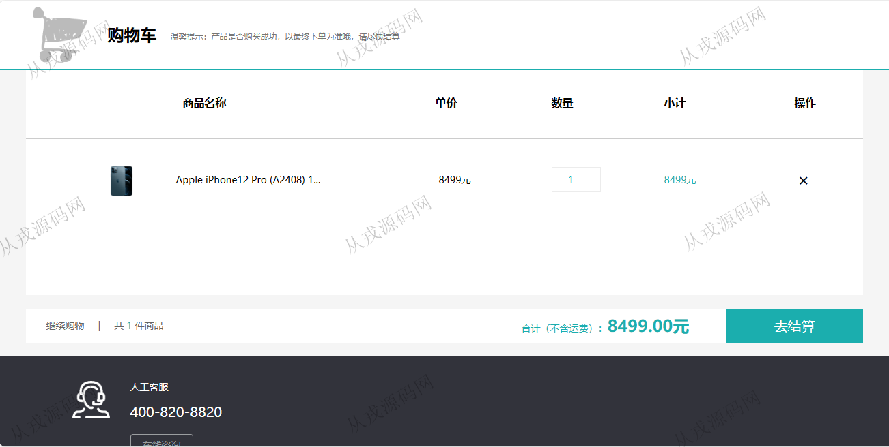
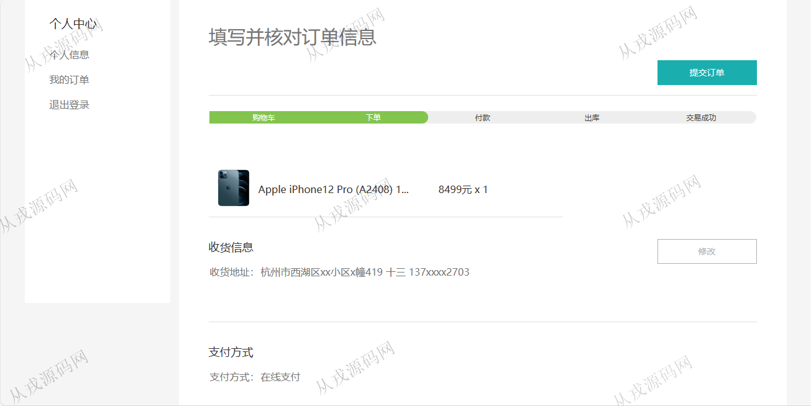
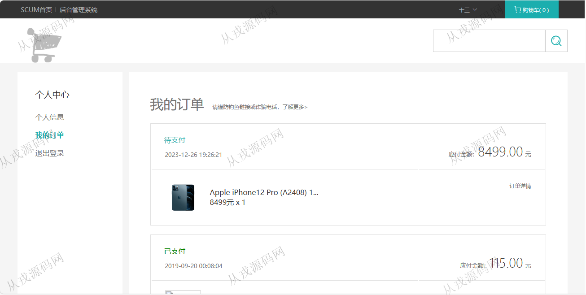
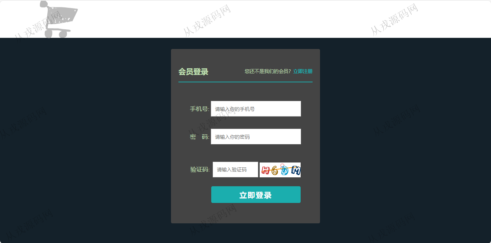
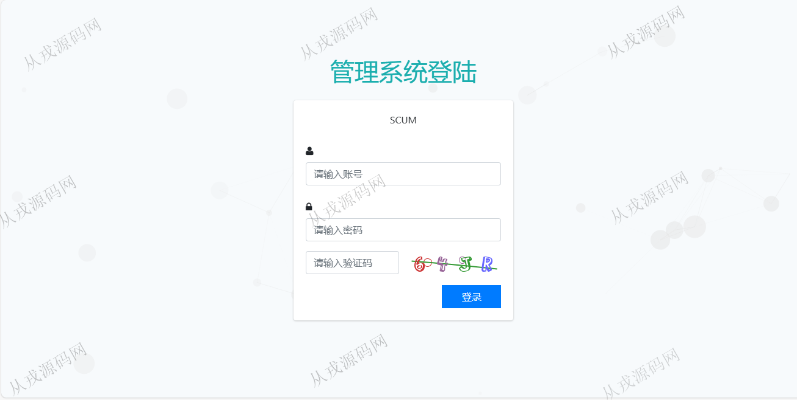
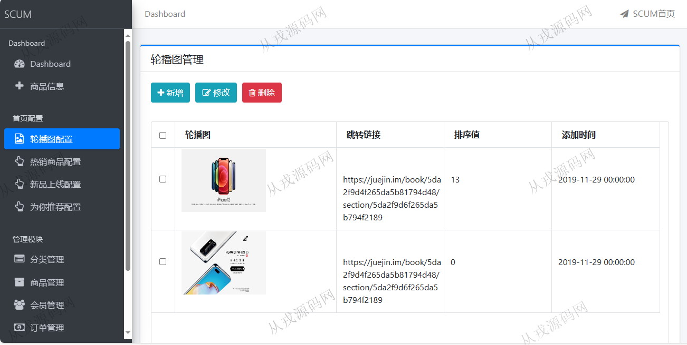
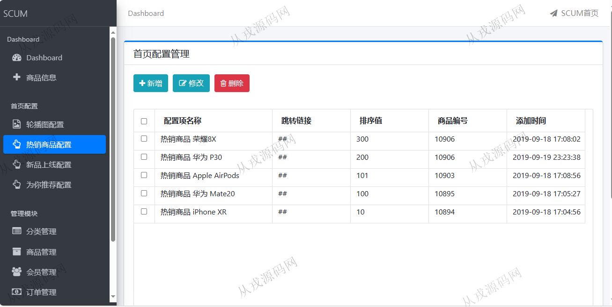
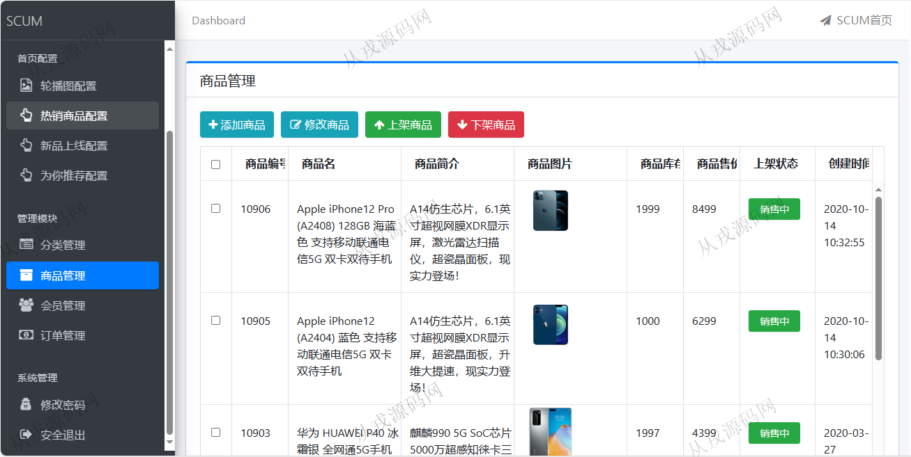
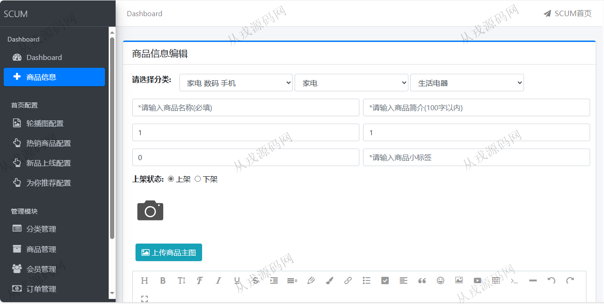
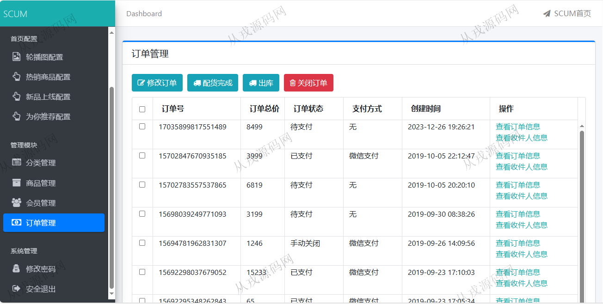

<h1 align="center">78.SCUM电子商城管理系统</h1>

 获取sql文件 QQ: 386869957 QQ群: 377586148 

 [推荐站点: 从戎源码网](https://armycodes.com/) 

## 简介

> 本代码来源于网络,仅供学习参考使用!
>
> 提供1.远程部署/2.修改代码/3.设计文档指导/4.框架代码讲解等服务
> 
> 用户端地址：http://localhost:8080/
> 
> 用户：13700002703 123456
> 
> 管理后台：http://localhost:8080/admin/login
> 
> admin 123456
>

## 项目介绍
基于springboot的SCUM电子商城管理系统：前端thymeleaf、jquery、bootstrap，后端 maven、springmvc、spring、mybatis，集成商品浏览，商品详情，购物车，在线支付，我的订单，管理后台发布商品等功能于一体的系统。

## 功能介绍

### 用户

- 基本功能：登录，注册，退出，个人资料查询，更改个人信息
- 首页：全局搜索，轮播图，分类导航，为你推荐，新品上线
- 商品信息：商品列表，商品详情，立即选购，加入购物车，购物车结算，在线支付
- 我的订单：订单信息查询，订单继续支付

### 管理员

- 商品管理：商品信息的增删改查，选择分类框三级联动，商品图片上传，商品上架和下架
- 分类管理：分类信息的增删改查，下级分类管理（最多支持三级）
- 会员管理：会员信息的增删改查，会员禁用，会员解禁
- 订单管理：订单列表查询，订单修改，订单详情，查看订单收件人信息，订单配货，订单出库，关闭订单
- 系统管理：修改密码
- 首页配置：轮播图配置，热销商品配置，新品上线配置，为你推荐配置

## 环境

- <b>IntelliJ IDEA 2021.3</b>

- <b>Mysql 5.7.26</b>

- <b>JDK 1.8</b>

## 运行截图

